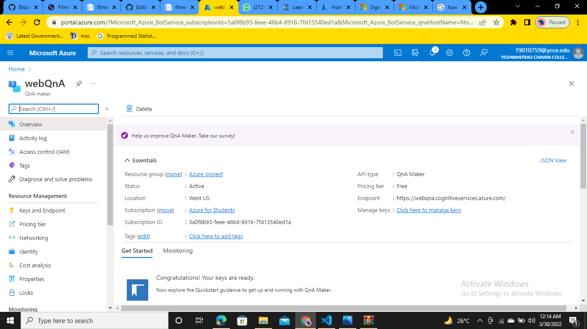
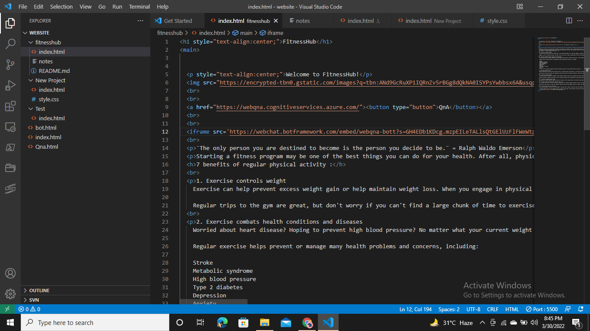

# FRT-project
 **Tanishque Gedam**
 \
 \
 ** (Proof of use of Azure Services for Project):**
 \
## Project Steps:
### Step 1: Create a resource group under QnA maker in Azure Portal
\

### Step 2: Create a knowledge base through the QnA Maker Portal
\
Note: Copy the iframe tag code to be embedded into website.
\
\

### Step 3: Create a Static Website from the Azure Portal
\

### Step 4: Write the code to create our website
\
Note: Paste the iframe tag code into the website code
\
\

\
### Step 6: Website is ready to watch
\
.png)
\

